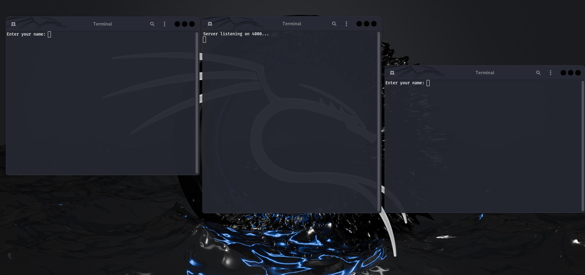
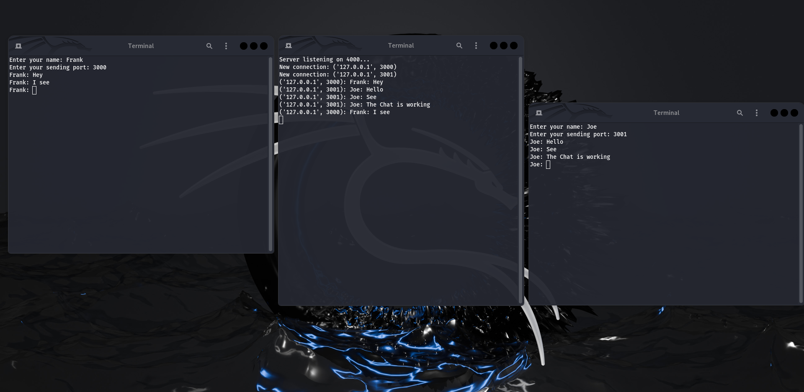

# **Terminal Chat**  

## **Description**  
Terminal Chat is a simple **multi-user chat application** that allows multiple clients to communicate in real-time through a central **server**. Each user can set their **username** and choose a **sending port** before joining the chat. Messages are **broadcasted** to all connected users.  

### **Features**  
- Multi-client chat system  
- Real-time message broadcasting  
- Customizable username and sending port  
- Simple and lightweight, runs on **Linux**  


## **Requirements**  
- **Linux** (Any distro)  
- **Python 3.x** installed  


## **Installation & Usage**  

### **Clone the Repository**  
```bash
git clone https://github.com/your-repo/terminal-chat.git
cd terminal-chat
```

### **Give Execution to Script**  

```bash
chmod +x ./Start.sh
```

### **Start the Application**  

```bash
./Start.sh
```

## **Screenshots**  

**🟢 Starting State**  
  

**💬 Working Chat Application**  
  

---

## **How It Works**  
1. **Start the Server** → Listens for incoming connections.  
2. **Launch Clients** → Users enter their **name** and **port**.  
3. **Chat in Real-Time** → Messages are **broadcasted** to all users.  
4. **Type `exit` to leave** → The server remains active for others.  

---

## **Customization**  
You can modify the **server port** and **default settings** in the `server.py` and `client.py` files.

---

## **License**  
This project is open-source and available under the [MIT License](License.txt).